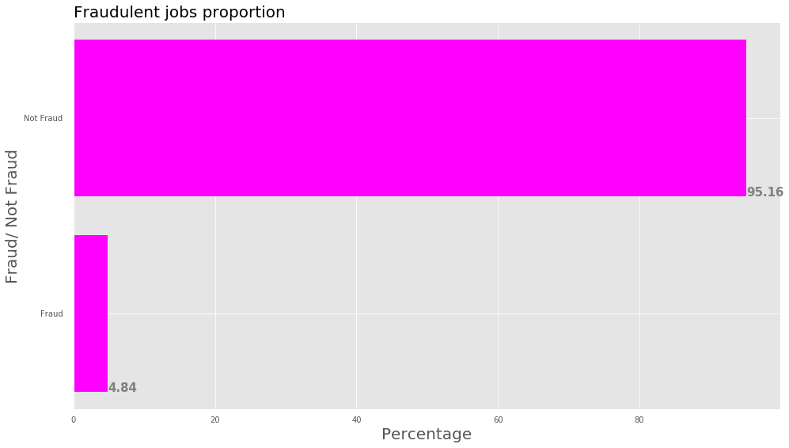

# Fraud Detection
images: EDA graphs

dating.ipynb: EDA, Base model, TD-IDF, LSTM analysis

helpers.py: helper functions

# Methods Used

Data Visualization

Natural Language Processing

Vectorization

Logistic Regression, Random Forest, Gradient Boosting

Recurrent Neural Netrwork: Long short-term memory (LSTM)

# Libraries Used

Pandas

Numpy

Sklearn

NLTK

TenserFlow

Keras

# Motivation and Goal
Having fraud jobs on one's website/app can result in losing users' interest. On the other hand flagging non-fraud jobs as fraud jobs may upset genuine companies. Hence, it is really important to correctly predict fraud and not fraud jobs.

# Data Pipeline

1. Download dataset from The Employment Scam Aegean Dataset (EMSCAD).

1. Select and clean relevant features.

1. Perfom exploratory data analysis.

1. Build baseline model.

1. Build up the model pipelines to train the model.

1. Use the trained model to predict the database collated from the data collection pipeline as a means of testing the performance of the model.

# Data

The dataset consists of 17,880 real-life job ads that aims at providing a clear picture of the Employment Scam problem including title of the job, location of the job, department, salary range, company, description, benefits, employment_type, required experience, required education', industry. Each row is flagged as fraud or not fraud.

### String Columns
| | | 
|-|-|
|Name| Description 
|Title| The title of the job ad entry.
|Location| Geographical location of the job ad.
|Department| Corporate department (e.g. sales).
|Salary range| Indicative salary range (e.g. $50,000-$60,000)

###  Binary 
| | | 
|-|-|
|Telecommuting| True for telecommuting positions. 
|Company logo| True if company logo is present
|Questions| True if screening questions are present.
|**Fraudulent**| 	Classification attribute.

### HTML fragment
| | | 
|-|-|
|Company profile| A brief company description. 
|Description| The details description of the job ad.
|Requirements| Enlisted requirements for the job opening.
|Benefits| 	Enlisted offered benefits by the employer.

### Nominal
| | | 
|-|-|
|Employment type| Full-type, Part-time, Contract, etc. 
|Required experience| Executive, Entry level, Intern, etc
|Required education| Doctorate, Master’s Degree, Bachelor, etc.
|Industry| Automotive, IT, Health care, Real estate, etc.
|Function| Consulting, Engineering, Research, Sales etc.

# Data Cleaning and prepping
* HTML tags were removed.
* Nans were replaced with "Not Specified"
* Salary range were split between tow categories, "specified" and "not specified"
* Location, education and industry categories were put under wider buckets and categies with less than 100 value counts were clubbed under "other" category.

### Preview
**Fraudulent jobs proportion**

## Choosing the right metric
Given highly imblalanced data set and the problem in hand, correctly identifying both fraud and not fraud job listings is crucial. Thus, F1 Score and area under Precision recall curve were optimized.

### Baseline Results
**Model with random guessing based on prior distribition of classes**
| | | 
|-|-|
|Precision| 0.044
|Recall| 0.046
|F1 Score| 0.045
|AUC| 0.063

### Recurrent Neural Network
**LSTM model using all title and HTML columns**
| | | 
|-|-|
|Precision| 0.507
|Recall| 0.617
|F1 Score| 0.529

### Final Results
**Random Forest Classifier**
| | | 
|-|-|
|Precision| 0.855
|Recall| 0.815
|F1 Score| 0.746
|AUC| 0.900

